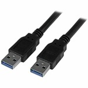
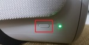
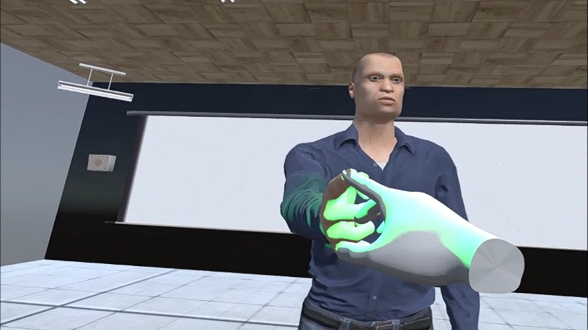

Contents

[Matériel](#_Toc114509185)

[Oculus Quest 2](#_Toc114509186)

[HTC Vive Pro Eye](#_Toc114509187)

[Ordinateur](#_Toc114509188)

[Installation du matériel](#_Toc114509189)

[1. Ouvrir l’ordinateur](#_Toc114509190)

[2. Brancher le Oculus Quest 2](#_Toc114509191)

[3. Brancher le HTC Vive Pro Eye](#_Toc114509192)

[Déroulement de l’expérience](#_Toc114509193)

[1. Démarrage de l’application utilisant Oculus](#_Toc114509194)

[2. Démarrage des outils Oculus](#_Toc114509195)

[3. Exécution des outils Oculus](#_Toc114509196)

[4. Fin des outils Oculus](#_Toc114509197)

[5. Démarrage de l’application utilisant HTC Vive](#_Toc114509198)

[6. Démarrage des outils HTC Vive](#_Toc114509199)

[7. Exécution des outils HTC Vive](#_Toc114509200)

[8. Fin des outils](#_Toc114509201)

[Scénario](#scénario)

[Description des outils](#description-des-outils)

[Everyday Task](#_Toc114509204)

[Finger Follow](#_Toc114509205)

[Finger Nose](#_Toc114509206)

[Rhythm](#_Toc114509207)

[Vibration](#_Toc114509208)

[Eye Contrast](#_Toc114509209)

[Speech Perception](#_Toc114509210)

[Pegboard](#_Toc114509211)

[Eye-Tracking Fixation](#_Toc114509212)

[Eye-Tracking Follow](#_Toc114509213)

[Eye-Tracking Multiple](#_Toc114509214)

[App Settings](#app-settings)

[Pegboard](#_Toc114509216)

[Finger Follow](#_Toc114509217)

[Everyday Task](#_Toc114509218)

[Rhythm](#_Toc114509219)

[Finger Nose](#_Toc114509220)

[Eye Contrast](#_Toc114509221)

[Speech Perception](#_Toc114509222)

[Vibration](#_Toc114509223)

[Eye Tracking Follow](#_Toc114509224)

[Eye Tracking Multiple](#_Toc114509225)

[Eye Tracking Fixation](#_Toc114509226)

[Scenario](#_Toc114509227)

[Autres options](#_Toc114509228)

## Matériel

### Oculus Quest 2

-   Casque

    

-   Contrôleurs

    

-   Fil de recharge

    

### HTC Vive Pro Eye

-   Casque

    

-   Contrôleurs

    

-   2 fils chargeurs pour les contrôleurs

    

-   2 prises muraux pour chaque fil chargeur pour contrôleur

    

-   2 stations pour le capteur de mouvement

    

-   2 tripods pour chaque station

    

-   2 fils station –\> mural

    

-   p1 centre périphérique

    

-   1 câble USB 3.0 du centre périphérique –\> ordinateur

    

-   1 adaptateur display port vers mini display port

    

-   1 fil display port du centre périphérique –\> adaptateur

    

-   1 fil du centre périphérique –\> mural

    

-   Power Bar

    

### Ordinateur

-   Fil de recharge

    

-   Portable

    

## 

## Installation du matériel

### Ouvrir l’ordinateur

Ouvrez le [portable](#portable). Le mot de passe est : **chum**. Utiliser le [fil de recharge](#filRechargeOrdinateur) pour qu’il soit branché à une source de courant étant donné que la batterie a une très faible durée de vie.

### Brancher le Oculus Quest 2

1.  Prennez le [fil de recharge](#filRechargeOculus) et le connecter au [Oculus Quest 2](#oculusQuest2) et au portable.
    1.  Mettez le casque sur votre tête et appuyer 5 secondes sur le bouton situé à droite du casque.
    2.  Lorsque le casque est ouvert, suivez exactement les étapes qui sont montrées dans ci-dessous.
        1.  Confirmez l’emplacement du sol
1.  Appuyez sur “Switch to stationary boundary”
    1.  Confirmez le choix précèdent
    2.  Ouvrez Quest Link pour se connecter à l’ordinateur à l’aide du casque.
        1.  Appuyez sur le bouton Oculus du contrôleur de la main droite
        2.  Ouvrez les Quick Settings en appuyant sur le bouton du menu à gauche
1.  Appuyez sur l’option Quest Link
1.  Montez le volume du Oculus Quest au maximum

### Brancher le HTC Vive Pro Eye

1.  Commencez par brancher la [power bar](#powerBar) à une prise murale. Celle-ci sera indispensable pour connecter tous les dispositifs.
2.  Installez les deux [stations](#stationsHTC) pour le capteur de mouvement sur les [tripods](#tripod).
3.  Connectez les deux [fils station –\> mural](#stationMural) à la power bar et ensuit à chaque station située sur les tripods. Les deux stations devraient être en diagonal de l’utilisateur et doivent avoir une vision l’une vers l’autre.
4.  Connectez le [câble USB 3.0](#câbleUSB) au [centre périphérique](#centrePériphérique). Connecter ensuite l’autre extrémité du câble USB 3.0 sur le portable.
5.  Connectez le [fil display port](#displayPort) au centre périphérique.
6.  Connectez [l’adaptateur diplay port –\> mini display port](#adaptateur) au fil display port. Connecter ensuite l’extrémité mini display port de l’adaptateur au portable.
7.  Connectez le [fil du centre périphérique –\> mural](#filCentreMural) sur la power bar.
8.  Connectez le [HTC Vive Pro Eye](#htcViveProEye) au [centre périphérique](#centrePériphérique). Appuyer sur le bouton se trouvant sur le centre périphérique. Une lumière verte devrait apparaître sur le centre périphérique et une lumière rouge devrait apparaître sur le casque.
9.  Ouvrez SteamVR sur le portable.
10. Faites la calibration du casque avec « Room Setup » sur SteamVR.
    1.  Appuyez sur le menu hamburger en haut à gauche
    2.  Appuyez sur « Configuration de la pièce »
    3.  Appuyez sur « Debout seulement »
    4.  Suivez ensuite les instructions de configuration de la pièce

## Déroulement de l’expérience

### Démarrage de l’application utilisant Oculus

Avant de commencer les outils Oculus, il est important **d’appuyer sur le** [**bouton**](#boutonCentre) se situant sur le [centre périphérique](#centrePériphérique) pour que le casque [HTC Vive Pro Eye](#htcViveProEye) soit fermé. Fermez aussi l’application StreamVR.

En premier lieu, mettez le casque [Oculus Quest 2](#oculusQuest2) sur le patient et ajustez-le à sa guise en tournant la roulette à l’arrière du casque. Ensuite, double cliquez sur l’icône **AtaxieOculus** se situant au milieu de l’écran de [l’ordinateur](#portable).

Vous verrez à l’écran ce que le patient voit dans le casque. Si jamais le patient n’est pas centré ou sa vue est décalée de l’activité, appuyez sur la touche **Espace** pour recentrer sa vue.

### Démarrage des outils Oculus

Chaque outil commencera par un tutoriel de l’outil que le patient devra effectuer. Une vidéo lui sera affichée en avant de lui et un texte à sa droite sera affiché pour explication détaillée. Lorsque la vidéo tutoriel sera fini, un bouton « Go » apparaîtra devant lui. Lorsqu’il sera prêt d’effectuer la tâche, le patient n’aura qu’à pointer et cliquer sur le bouton « Go » à l’aide du bouton de l’index de la manette droite. Si jamais l’utilisation des contrôleurs est un problème pour le patient, la touche **Flèche Droite** du clavier peut être utilisé pour l’aider à commencer la tâche.

### Exécution des outils Oculus

Lorsque le patient aura fini d’effectuer une tâche, un texte à sa droite apparaîtra pour lui indiquer que la tâche est finie. Un bouton « Go » sera affiché en avant de lui pour passer à la prochaine tâche. Si jamais l’utilisation des contrôleurs est un problème pour le patient, la touche **Flèche Droite** du clavier peut être utilisé pour l’aider à passer à l’autre tâche. Si jamais l’on désire recommencer une tâche, appuyer sur la touche **R** du clavier. La touche **Flèche Droite** peut aussi être utilisée pour changer de tâche si jamais celle-ci ne peut pas être complétée par le patient.

### Fin des outils Oculus

Lorsque le patient ne peut changer de tâche, ceci signifie que le scénario Oculus est finit. Le patient peut donc passer aux outils HTC pour le Eye-Tracking. **Il est aussi important de déconnecter le casque Oculus Quest 2 du portable.**

### Démarrage de l’application utilisant HTC Vive

Avant de commencer les outils HTC Vive, il est important **d’appuyer sur le** [**bouton**](#boutonCentre) se situant sur le [centre périphérique](#centrePériphérique) pour que le casque [HTC Vive Pro Eye](#htcViveProEye) soit ouvert. Si celui-ci n’est toujours pas ouvert (une lumière rouge sur le casque), ouvrez SteamVR en double cliquant sur l’application.

En premier lieu, mettez le casque HTC Vive Pro Eye sur le patient et ajustez-le à sa guise en tournant la roulette à l’arrière du casque. Ensuite, double cliquez sur l’icône **AtaxieHTC** se situant au milieu de l’écran de [l’ordinateur](#portable).

Un pop-up apparaîtra pour activer le Eye-Tracking. Appuyez sur « Yes » pour activer le Eye-Tracking.

Le patient effectuera la calibration des yeux dans le casque. Vous pourrez voir ce qu’il voit à l’aide du Display VR View de SteamVR.

Vous verrez à l’écran ce que le patient voit dans le casque. Si jamais le patient n’est pas centré ou sa vue est décalée de l’activité, appuyez sur la touche **Espace** pour recentrer sa vue.

### Démarrage des outils HTC Vive

Chaque outil commencera par un tutoriel de l’outil que le patient devra effectuer. Une vidéo lui sera affichée en avant de lui et un texte à sa droite sera affiché pour explication détaillée. Lorsque la vidéo tutoriel sera fini, un bouton « Go » apparaîtra devant lui. Lorsqu’il sera prêt d’effectuer la tâche, le patient n’aura qu’à pointer et cliquer sur le bouton « Go » à l’aide du bouton situé en dessous de la manette droite. Si jamais l’utilisation des contrôleurs est un problème pour le patient, la touche **Flèche Droite** du clavier peut être utilisé pour l’aider à commencer la tâche.

### Exécution des outils HTC Vive

Lorsque le patient aura fini d’effectuer une tâche, un texte à sa droite apparaîtra pour lui indiquer que la tâche est finie. Si jamais l’utilisation des contrôleurs est un problème pour le patient, la touche **Flèche Droite** du clavier peut être utilisé pour l’aider à passer à l’autre tâche. Si jamais l’on désire recommencer une tâche, appuyer sur la touche **R** du clavier. Un bouton « Go » sera affiché en avant de lui pour passer à la prochaine tâche. La touche **Flèche Droite** peut aussi être utilisée pour changer de tâche si jamais celle-ci ne peut pas être complétée par le patient.

### Fin des outils

L’application fermera toute seule lorsque le patient aura fini les tâches. Veuillez enlever le retirer le casque du patient.

## Scénario

L’ordre des outils à effectuer sera fait au hasard. Deux fichiers de configuration sera généré pour chaque patient et l’ordre des outils sera déterminé par une fonction (exemple de sortie de la fonction: 2-4-3-5-7-6-8-1). Avant d’effectuer une tâche pour les acquisitions, le patient aura une vidéo de tutoriel à regarder et une session de pratique. Le nombre de répétitions des acquisitions sera déterminé dans le fichier de configuration. Il est important de commencer par les tâches d’Oculus avant d’effectuer les tâches de Eye-Tracking. Le nombre de répétitions des tâches est documenté dans l’annexe 1.

## Description des outils

### Everyday Task

L’utilisateur devra verser de l’eau d’un verre vers un autre. L’objectif de cette tâche est d’évaluer la précision et le tremblement de l’utilisateur lorsqu’il verse le liquide dans un autre contenant. Un patient atteint d’ataxie de Friedreich sera limité dans ses tâches quotidiennes plus que la maladie progresse. Ces tremblements seront beaucoup plus intenses, la précision du versement du liquide reflètera ce symptôme.

Le patient verra une ligne rouge dans son environnement. Il est important que le verre contenant le liquide initial soit situé au-dessus de la ligne lorsqu’il versera le liquide dans l’autre contenant.

La tâche sera effectuée **4 fois** dans le scénario proposé (**1 pratique et 3 acquisitions**). Les utilisateurs démontrent une courbe d’apprentissage pour cette tâche, répéter celle-ci 2 fois permet d’aller chercher des données plus représentatives sur sa performance.

### Finger Follow

L’utilisateur devra suivre le doigt d’un avatar (représentant un clinicien) avec son propre doigt (n’importe quel index). Cette tâche est une alternative au test doigt-nez. Le nombre de répétitions (trajectoires du doigt) dans le scénario est **10 par essai.** La tâche sera effectuée **4 fois** dans le scénario proposé (**1 pratique et 3 acquisitions**).

### Finger Nose

Ce test est une réplication du test effectué en clinique « Finger-Nose-Finger Test ». L’objectif de ce test est de tester le mouvement régulier de l’utilisateur et la coordination des membres supérieurs. L’utilisateur devra toucher le doigt de l’avatar devant lui, ensuite une boule rouge apparaîtra pour représenter le nez, il devra toucher celui-ci et répéter ce mouvement plusieurs fois. Le nombre de répétitions (trajectoires du doigt) dans le scénario est **10 par essai.** La tâche sera effectuée **4 fois** dans le scénario proposé (**1 pratique et 3 acquisitions**).

### Rhythm

L’outil de rythme réplique la tâche de rythme utilisée cliniquement. La tâche utilisé cliniquement demande au patient de répliquer un rythme quelconque avec son doigt ou son pied. Dans l’environnement en réalité virtuelle, le patient voit des notes apparaîtrent et il doit appuyer sur la touche index d’un des contrôlleurs pour répliquer le rythme (même si les notes sont disparues). Le nombre de **répétitions sera 15 par essai avec un bpm de 100.** La tâche sera effectuée **4 fois** dans le scénario proposé (**1 pratique et 3 acquisitions**).

### Vibration

Les patients atteints de l’ataxie de Friedreich ressentent une perte de la sensibilité aux vibrations. Cette perte est considérable lorsque la maladie est avancée. Cette tâche permet de tester cette perte de sensibilité. Au début de la tâche, les contrôlleurs ne produiront aucune vibration. Celles-ci seront activées et augmenteront en intensité selon le temps. Le patient aura à appuyer sur la touche index d’un des contrôlleurs. Aucun feedback visuel sera montré à l’utilisateur, seulement ses contrôlleurs seront visibles. Le nombre de vibration à tester sera **5 par essai.** La tâche sera effectuée **3 fois** dans le scénario proposé (**1 pratique et 2 acquisitions**).

### Eye Contrast

Certains patients de l’ataxie de Friedreich ont une perte de sensibilité au contraste causé par une réduction de l’épaisseur de la couche de fibres nerveuses rétiniennes. Cette tâche permet de tester cette réduction de sensibilité. Le patient verra 5 lettres disposées devant lui et un écran blanc. Une lettre apparaîtra sur l’écran blanc, cependant le contraste de la lettre changera au fil du temps. Lorsque le patient commencera à voir la lettre, il devra pointer et appuyer sur une des 5 lettres disposées devant lui pour indiquer ce qu’il voit. Le nombre de répétitions de contraste à tester sera **4 par essai.** Le scénario aura **1 essai pratique et 2 essais pour les acquisitions.**

### Speech Perception

Plusieurs patients atteints d’ataxie de Friereich déclarent avoir de la misère à entendre, comme s’ils souffraient de surdité. Cependant, leur habilité à entendre ne provient pas de surdité, mais d’une difficulté de compréhension d’élocution avec un bruit de fond. Cette tâche vient tester cette difficulté d’élocution. Le patient verra 5 lettres disposées devant lui. Il entendra une personne prononcer des lettres. Un bruit de fond sera aussi activé et ce bruit de fond augmentera au fil du temps. Lorsque l’utilisateur entendra la lettre, il devra pointer et appuyer sur une des 5 lettres disposées devant lui pour indiquer ce qu’il entend. Le **nombre d’augmentation de volume du bruit de fond sera de** **6** et le **nombre de répétitions de la diction de la lettre sera de 2 par répétitions de volume, donc 12 répétitions au total par essai**. Le scénario aura **1 essai pratique et 2 essais pour les acquisitions.**

### Pegboard

La tâche de pegboard en réalité virtuelle vient répliquer la tâche du « Nine Hole Peg Test » utilisée en clinique. La tâche en réalité virtuelle est en mode vertical et le pegboard est beaucoup plus gros pour la rendre plus facile à effectuer. Le scénario aura **1 essai pratique et 2 essais pour les acquisitions.**

**  
**

### Eye-Tracking Fixation

Une cible sera montrée à l’utilisateur et celui-ci devra le fixer pour un temps déterminé. Un indicateur progressera pour lui montrer le temps de fixation restant Cette tâche permet de tester les Square Wave Jerks possibles durant la fixation. Le temps de fixation pour le scénario sera de **7 secondes.** Le scénario aura **1 essai pratique et 3 essais pour les acquisitions.**

### Eye-Tracking Follow

Une cible qui bouge sera montrée à l’utilisateur et celui-ci devra le suivre pour un certain nombre de répétitions. Cette tâche est une réplication du test neurologique couramment utilisé pour évaluer le mouvement des yeux. Le nombre de répétitions dans le scénario sera de **10 par essai.** Le scénario aura **1 essai pratique et 2 essais pour les acquisitions.**

### Eye-Tracking Multiple

****L’utilisateur verra 5 cibles disposées devant lui. Un patron de suivi sera activé et il devra regarder la cible activée. Un temps de fixation lui sera montré. Cette tâche est une réplication du test neurologique, mais les trajectoires seront verticales et horizontales. Le scénario aura **1 essai pratique et 2 essais pour les acquisitions**

## App Settings

Le fichier appsettings.json contient toutes les options disponibles pour influencer les outils et le fonctionnement général de l'application.

### Pegboard

-   « isTimerShowed » est utilisé pour montrer à l'utilisateur une minuterie pour le temps qu'il lui faut pour terminer l'outil de panneau perforé.

### Finger Follow

-   « repetitions » est utilisé pour définir le nombre de répétitions que l'avatar va faire lorsqu'il change de direction.
-   « mode » est une variable utilisée pour déterminer la trajectoire que va prendre l'avatar. Le mode 0 correspond aux directions aléatoires standard, le mode 1 correspond toujours aux directions aléatoires mais avec des vitesses incrémentielles différentes, le mode 2 correspond aux directions ciblées (trajectoire carrée).

### Everyday Task

-   « height » sert à régler la hauteur au-dessus de laquelle l'utilisateur doit se trouver pour verser le liquide dans le récipient.

### ****Rhythm

-   « mode » est le comportement de l'outil. 0 correspond au mode normal, ce qui signifie que les notes sortiront à un certain BPM. 1 est pour le mode clinique, ce qui signifie que les notes sortent à un BPM irrégulier, en morceaux de notes.
-   « nbNotes » détermine le nombre de notes que l'application va produire jusqu'à ce qu'elle se termine. Cette variable est utilisée par le mode 0.
-   « bpm » est la vitesse en battements par minute à laquelle les appuis sont censés se produire. Plus le nombre est élevé, plus il devient rapide. Cette variable est utilisée par le mode 0.
-   « repetitions » est le nombre de répétitions de morceaux de notes. Cette variable est utilisée par le mode 1.
-   « nbNotesPerRepetitions » est le nombre de notes dans un bloc de notes. Cette variable est utilisée par le mode 1.

### Finger Nose

-   « repetitions » est utilisé pour définir le nombre de répétitions que l'avatar va faire lorsqu'il change de direction.

### Eye Contrast

-   « repetitions » est le nombre de fois qu'une lettre aléatoire apparaîtra.

### Speech Perception

-   « repetitionsPerVolume » est le nombre de fois qu'une lettre sera dite par le narrateur pour chaque niveau de volume.
-   « nbVolumeIncreases » est le nombre d'incréments de volume.

### Vibration

-   “repetitions” est le nombre de fois que nous testons la sensibilité aux vibrations.

### Eye Tracking Follow

-   « targetSize » définit la taille du cube que la cible doit regarder.
-   « repetitions » est utilisé pour définir le nombre de répétitions que le cube va faire lorsqu'il change de direction.
-   « speed » détermine la vitesse à laquelle le cube va se déplacer.

### Eye Tracking Multiple

-   « timer » est le temps pendant lequel une cible doit être regardée avant de passer à une autre cible.
-   « targetSize » définit la taille des cubes que le patient doit regarder.
-   « fieldOfView » détermine la distance entre les cibles. Plus le nombre est élevé, plus ils sont éloignés l'un de l'autre.

### Eye Tracking Fixation

-   « targetSize » est la taille du cube que l'utilisateur doit regarder. “
-   « distance » définit la distance entre l'utilisateur et la cible.
-   « timeFixation » est le temps pendant lequel une cible doit être regardée.

### Scenario

Les outils pouvant être réalisés dans un scénario sont listés dans « ToolsOrder ». Les scènes doivent être nommées correctement dans cette liste et l'ordre est descendant (de haut en bas).

Les scenes sont les suivantes:

"FingerNoseScene",

"FingerFollowScene",

“PegboardScene”,

"PegboardAlternativeScene_AutoHand",

“PegboardAlternativeScene_HandTracking”,

“EverydayTaskScene”,

"RhythmScene",

“SpeechPerceptionScene”,

“Eye Contrast Scene”,

“VibrationScene”,

“MenuScene”,

“EyeTrackingFixationScene”,

“EyeTrackingFollowScene”,

“EyeTrackingMultipleScene”

### Autres options

-   « ScenarioActive » détermine si le scénario est censé être fait par l'utilisateur. L'utilisateur commencera au premier ensemble d'outils dans « ToolsOrder »
-   « ActivateTutorial » détermine si l'utilisateur voit le didacticiel de chaque outil, chaque fois qu'il arrive dans une nouvelle scène.
-   « UseMongo » est utilisé pour enregistrer les données récupérées des outils dans la base de données.
-   « Locale » vous permet de changer la langue de l'application. Les options disponibles sont « en », « fr » ou « es ».
