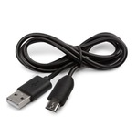
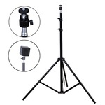
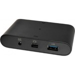
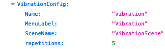

## Purpose

Friedreich's ataxia is an incurable neurodegenerative disease that manifests itself through several symptoms. Patients present with difficulty walking, increased cerebellar tremor, speech impairment, increased eye abnormalities, loss of coordination and cardiomyopathy which is the main cause of death in AF patients. 

Several assessment instruments exist to quantify disease progression, such as the FARS, however, this scale is limited when patients are no longer ambulant and is limited by its subjective nature of clinical assessment. It is therefore crucial to develop more objective tools for the upper extremities to measure FA progression.

With this in mind, we use virtual reality to design precise tools. We created a virtual environment using the Oculus Quest 2 for upper extremity assessment, and the HTC Vive Pro Eye for ocular abnormalities. We have developed a series of tasks in virtual reality, including 8 for upper limbs and 3 for ocular anomalies.

## Conception

   

   

## Hardware

### Oculus Quest 2

-   Headset

    

-   Controllers

    

-   Recharge cable

    

### HTC Vive Pro Eye

-   Headset

    

-   Controllers

    

-   2 charger cables for the controllers

    

-   2 wall sockets for each charger cable for controller

    

-   2 stations for the motion sensor

    

-   2 tripods for each station

    

-   2 station cables –\> mural

    

-   Peripheral center

    

-   1 USB 3.0 cable from the peripheral center –\> computer

    

-   1 DisplayPort to Mini DisplayPort adapter

    

-   1 DisplayPort cable from the peripheral center –\> adapter

    

-   1 cable from the peripheral center –\> mural

    

-   Power Bar

    

### Computer

-   Charging cable

    

-   Computer

    

## 

## Hardware installation.

### Connect the Oculus Quest 2

1.  Take the [charging cable](#filRechargeOculus) and connect it to the [Oculus Quest 2](#oculusQuest2) and to the computer.
2.  Put the headset on your head and press the button located on the right side of the headset for 5 seconds.

3.  When the headset is turned on, follow the steps exactly as shown below.
    
    1.  Confirm the floor location.
    
    
    
    2.  Press "Switch to stationary boundary."
    
    
    
    3.  Confirm the previous choice.
    
    

4.  Open Quest Link to connect the headset to the computer.
    
    1.  Press the Oculus button on the right-hand controller.
    
    
    
    2.  Open the Quick Settings by pressing the menu button on the left.
    
    
    
    3.  Press the Quest Link option.
    
    

5.  Turn up the volume of the Oculus Quest to the maximum.

### Connect the HTC Vive Pro Eye

1.  Start by plugging the [power bar](#powerBar) into a wall outlet. This will be essential for connecting all the devices.
2.  Install the two [stations](#stationsHTC) for the motion sensor on the [tripods](#tripod).
3.  Connect the two [station cables –\> mural](#stationMural) to the power bar and then to each station located on the tripods. The two stations should be diagonally positioned from the user and must have a line of sight towards each other.

4.  Connect the [USB 3.0 cable](#câbleUSB) to the [peripheral center](#centrePériphérique). Next, connect the other end of the USB 3.0 cable to the laptop.
5.  Connect the [display port cable](#displayPort) to the peripheral center.
6.  Connect the [diplay port adapter –\> mini display port](#adaptateur) to the display port cable. Next, connect the mini display port end of the adapter to the laptop.
7.  Connect the [peripheral center cable –\> mural](#filCentreMural) to the power bar.
8.  Connect the [HTC Vive Pro Eye](#htcViveProEye) to the [peripheral center](#centrePériphérique). Press the button located on the peripheral center. A green light should appear on the peripheral center, and a red light should appear on the headset.

9.  Open SteamVR.

10. Perform the headset calibration using "Room Setup" in SteamVR.
    1.  Press the hamburger menu icon located at the top left.
    2.  Press "Room Setup" in the menu.
    3.  Press "Standing Only".
    4.  Then follow the room setup instructions provided.

## Experiment progression

### Launching the application using Oculus.

Before starting the Oculus tools, it is important to **press the** [**button**](#boutonCentre) located on the [peripheral center](#centrePériphérique) so that the [HTC Vive Pro Eye](#htcViveProEye) headset stays closed. Also, close the SteamVR application.

First, place the [Oculus Quest 2](#oculusQuest2) headset on the patient and adjust it to their liking by turning the knob at the back of the headset. Then, double-click on the **AtaxieOculus** icon located in the folder **./Builds/Oculus**.

You will see on the screen what the patient sees inside the headset. If the patient is not centered or their view is misaligned with the activity, press the **Space** key to recentre their view.

### Starting the Oculus tools.

Each tool will start with a tutorial of the task that the patient needs to perform. A video will be displayed in front of them, and a text explanation will appear on the right side. Once the tutorial video is finished, a "Go" button will appear in front of the patient. When they are ready to perform the task, the patient just needs to point and click on the "Go" button using the index finger button on the right controller. If the use of the controllers is a challenge for the patient, they can use the **Right Arrow** key on the keyboard to help them initiate the task.

### Oculus tools execution

When the patient has finished performing a task, a text to the right will appear to indicate that the task is finished. A "Go" button will be displayed in front of them to proceed to the next task. If the use of controllers is a problem for the patient, the **Right Arrow** key on the keyboard can be used to help them move to the next task. If the patient wants to restart a task, they can press the **R** key on the keyboard. The **Right Arrow** key can also be used to switch tasks if the patient is unable to complete the current one.

### Oculus tools end

When the patient is unable to switch tasks, it means that the Oculus scenario is finished. The patient can now move on to the HTC tools for Eye-Tracking. **It is also important to disconnect the Oculus Quest 2 headset from the laptop.**

### Launching the application using HTC Vive Pro Eye

Before starting the HTC Vive tools, it is important **to press the** [**button**](#boutonCentre) located on the [peripheral center](#centrePériphérique) so that the [HTC Vive Pro Eye](#htcViveProEye) headset turns on. If it is still not turned on (a red light on the headset), open SteamVR by double-clicking on the application.

First, place the HTC Vive Pro Eye headset on the patient and adjust it to their liking by turning the dial at the back of the headset. Then, double-click on the **AtaxieHTC** icon located in the folder **./Builds/HTC**

A pop-up will appear to activate the Eye-Tracking. Press "Yes" to enable Eye-Tracking.

The patient will perform eye calibration in the headset. You will be able to see what they see using the Display VR View on SteamVR.

You will see on the screen what the patient sees in the headset. If the patient is not centered or their view is misaligned with the activity, press the **Space** key to recenter their view.

### Starting the HTC Vive tools.

Each tool will start with a tutorial of the task that the patient needs to perform. A video will be displayed in front of them, and text on the right side will provide detailed explanations. Once the tutorial video is finished, a "Go" button will appear in front of them. When the patient is ready to perform the task, they simply need to point and click on the "Go" button using the button located below the right controller. If the use of controllers is challenging for the patient, they can use the **Right Arrow** key on the keyboard to assist them in starting the task.

### HTC Vive tools execution

When the patient has completed a task, text will appear on the right side to indicate that the task is finished. If the patient is having difficulty with the controllers, they can use the **Right Arrow** key on the keyboard to help them move to the next task. If they want to restart a task, they can press the **R** key on the keyboard. A "Go" button will be displayed in front of them to proceed to the next task. The **Right Arrow** key can also be used to switch tasks if the current task cannot be completed by the patient.

### Tools ended

The application will close automatically when the patient has completed the tasks. You can then remove the headset from the patient, making sure it is disconnected from the computer or VR system. Also, please ensure that all equipment and accessories used during the session are properly stored.

## Scenario

The order of the tools to be performed will be randomized. Two configuration files will be generated for each patient, and the order of the tools will be determined by a function (example function output: 2-4-3-5-7-6-8-1). Before performing a task for data acquisition, the patient will watch a tutorial video and have a practice session. The number of repetitions for the data acquisition tasks will be determined in the configuration file. It is important to start with the Oculus tasks before proceeding to the Eye-Tracking tasks. The number of task repetitions is documented in Appendix 1.

## Tools descriptions

### Everyday Task

The user will be required to pour water from one glass to another. The objective of this task is to evaluate the user's precision and tremor when pouring liquid into another container. A patient with Friedreich's ataxia will be more limited in their daily tasks as the disease progresses. The tremors experienced will be much more pronounced, and the accuracy of pouring the liquid will reflect this symptom.

The patient will see a red line in their environment. It is important that the glass containing the initial liquid is positioned above the line when pouring the liquid into the other container.

The task will be performed **4 times** in the proposed scenario (**1 practice and 3 acquisitions**). Users demonstrate a learning curve for this task, and repeating it twice allows for more representative data to be collected on their performance.

### Finger Follow

The user will be required to follow the finger of an avatar (representing a clinician) with their own finger (any index finger). This task serves as an alternative to the finger-nose test. The number of repetitions (finger trajectories) in the scenario is **10 per trial**. The task will be performed **4 times** in the proposed scenario (**1 practice and 3 acquisitions**).

### Finger Nose

This test is a replication of the "Finger-Nose-Finger Test" performed in clinical settings. The objective of this test is to assess the user's smooth movement and coordination of the upper limbs. The user will be required to touch the finger of the avatar in front of them, and then a red ball representing the nose will appear, which they must touch. This movement will be repeated multiple times. The number of repetitions (finger trajectories) in the scenario is **10 per trial**. The task will be performed **4 times** in the proposed scenario (**1 practice and 3 acquisitions**).

### Rhythm

The rhythm tool replicates the clinically used rhythm task. The clinical task requires the patient to replicate a given rhythm with their finger or foot. In the virtual reality environment, the patient will see notes appearing, and they must press the index button on one of the controllers to replicate the rhythm, even after the notes have disappeared. The number of repetitions will be **15 per trial with a bpm of 100**. The task will be performed **4 times** in the proposed scenario (**1 practice and 3 acquisitions**).

### Vibration

Patients with Friedreich's ataxia experience a loss of sensitivity to vibrations. This loss is significant as the disease progresses. This task is designed to test this loss of sensitivity. At the beginning of the task, the controllers will not produce any vibrations. The vibrations will be activated and increase in intensity over time. The patient will need to press the index button on one of the controllers. No visual feedback will be provided to the user, only the controllers will be visible. The number of vibrations to be tested will be **5 per trial**. The task will be performed **3 times** in the proposed scenario (**1 practice and 2 acquisitions**).

### Eye Contrast

Some patients with Friedreich's ataxia experience a loss of contrast sensitivity due to a reduction in the thickness of the retinal nerve fiber layer. This task is designed to test this reduction in sensitivity. The patient will see 5 letters displayed in front of them on a white screen. A letter will appear on the white screen, but the contrast of the letter will change over time. When the patient starts to see the letter, they need to point and press one of the 5 letters in front of them to indicate what they see. The number of contrast repetitions to be tested will be **4 per trial**. The scenario will have **1 practice trial and 2 acquisition trials**.

### Speech Perception

Many patients with Friedreich's ataxia report having difficulty hearing, as if they were experiencing deafness. However, their ability to hear is not due to deafness but rather a difficulty in speech comprehension with background noise. This task aims to test this difficulty in speech comprehension. The patient will see 5 letters displayed in front of them. They will hear a person pronouncing letters, and a background noise will also be activated, gradually increasing over time. When the user hears the letter, they need to point and press one of the 5 letters in front of them to indicate what they hear. The **number of background noise volume increases will be 6**, and the **number of letter pronunciation repetitions will be 2 per volume repetition, resulting in a total of 12 repetitions per trial. The scenario will have 1 practice trial and 2 acquisition trials**.

### Pegboard

The virtual reality pegboard task replicates the "Nine Hole Peg Test" used in clinical settings. The virtual reality task is in a vertical mode, and the pegboard is larger to make it easier to perform. The scenario will consist of **1 practice trial and 2 acquisition trials**.

### Eye-Tracking Fixation

The user will be presented with a target and they will have to fixate on it for a specified duration. A progress indicator will show the remaining fixation time. This task is designed to test for possible Square Wave Jerks during fixation. The fixation time for the scenario will be **7 seconds**. The scenario will consist of **1 practice trial and 3 acquisition trials**.

### Eye-Tracking Follow

The user will be presented with a moving target and they will have to track its movement for a certain number of repetitions. This task is a replication of the commonly used neurological test to assess eye movement. The number of repetitions in the scenario will be **10 per trial**. The scenario will consist of **1 practice trial and 2 acquisition trials**.

### Eye-Tracking Multiple

The user will see 5 targets arranged in front of them. A tracking pattern will be activated, and they will have to focus on the active target. A fixation time will be displayed. This task is a replication of the neurological test, but the trajectories will be vertical and horizontal. The scenario will consist of **1 practice trial and 2 acquisition trials**.

## App Settings

The appsettings.json file contains all the available options to influence the tools and general operation of the application.

### Pegboard

-   « isTimerShowed » is used to show the user a timer for the time it takes to complete the Pegboard tool.

### Finger Follow

-   "repetitions" is used to define the number of repetitions the avatar will make when changing direction.
-   "mode" is a variable used to determine the trajectory the avatar will take. Mode 0 corresponds to standard random directions, mode 1 corresponds to random directions with different incremental speeds, and mode 2 corresponds to targeted directions (square trajectory).

### Everyday Task

-   "height" is used to adjust the height at which the user needs to be positioned in order to pour the liquid into the container.

### Rhythm

-   "mode" is the behavior of the tool. 0 corresponds to the normal mode, which means the notes will come out at a certain BPM (beats per minute). 1 is for the clinical mode, which means the notes come out at an irregular BPM, in chunks of notes.
-   "nbNotes" determines the number of notes the application will produce until it finishes. This variable is used in mode 0.
-   "bpm" is the speed in beats per minute at which the keystrokes are supposed to occur. The higher the number, the faster it becomes. This variable is used in mode 0.
-   "repetitions" is the number of repetitions of note chunks. This variable is used in mode 1.
-   "nbNotesPerRepetitions" is the number of notes in a block of notes. This variable is used in mode 1.

### Finger Nose

-   "repetitions" is used to define the number of repetitions the avatar will make when changing direction.

### Eye Contrast

-   "repetitions" is the number of times a random letter will appear.

### Speech Perception

-   "repetitionsPerVolume" is the number of times a letter will be spoken by the narrator for each volume level.
-   "nbVolumeIncreases" is the number of volume increments.

### Vibration

-   "repetitions" is the number of times we test the sensitivity to vibrations.

### Eye Tracking Follow

-   "targetSize" defines the size of the cube that the target should look at.
-   "repetitions" is used to set the number of repetitions the cube will make when changing direction.
-   "speed" determines the speed at which the cube will move.

### Eye Tracking Multiple

-   "timer" is the duration for which a target must be looked at before moving on to another target.
-   "targetSize" defines the size of the cubes that the patient needs to look at.
-   "fieldOfView" determines the distance between the targets. The higher the number, the farther apart they are from each other.

### Eye Tracking Fixation

-   "targetSize" is the size of the cube that the user needs to look at.
-   "distance" defines the distance between the user and the target.
-   "timeFixation" is the duration for which a target needs to be looked at.

### Scenario

The tools that can be performed in a scenario are listed in "ToolsOrder". The scenes should be correctly named in this list, and the order is descending (from top to bottom).

The scenes are as follows:

"FingerNoseScene",

"FingerFollowScene",

“PegboardScene”,

"PegboardAlternativeScene_AutoHand",

“PegboardAlternativeScene_HandTracking”,

“EverydayTaskScene”,

"RhythmScene",

“SpeechPerceptionScene”,

“Eye Contrast Scene”,

“VibrationScene”,

“MenuScene”,

“EyeTrackingFixationScene”,

“EyeTrackingFollowScene”,

“EyeTrackingMultipleScene”

### Other options

-   "ScenarioActive" determines if the scenario is supposed to be performed by the user. The user will start with the first set of tools in "ToolsOrder".
-   "ActivateTutorial" determines if the user will see the tutorial for each tool every time they arrive in a new scene.
-   "UseMongo" is used to save the data collected from the tools into the database.
-   "Locale" allows you to change the language of the application. The available options are "en" for English, "fr" for French, or "es" for Spanish.